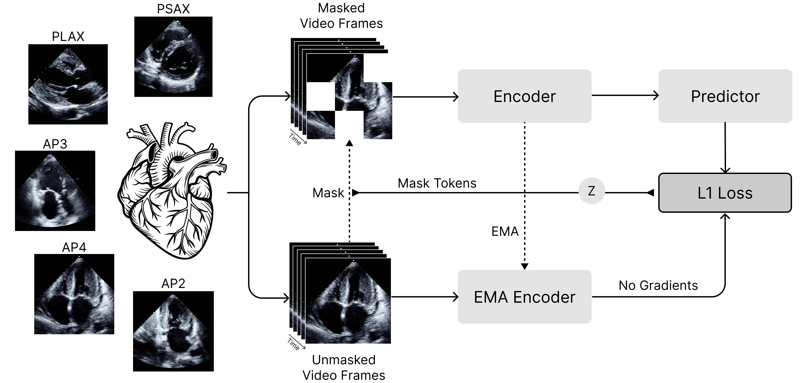
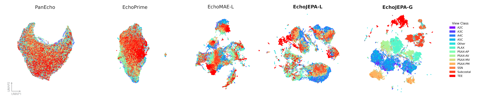
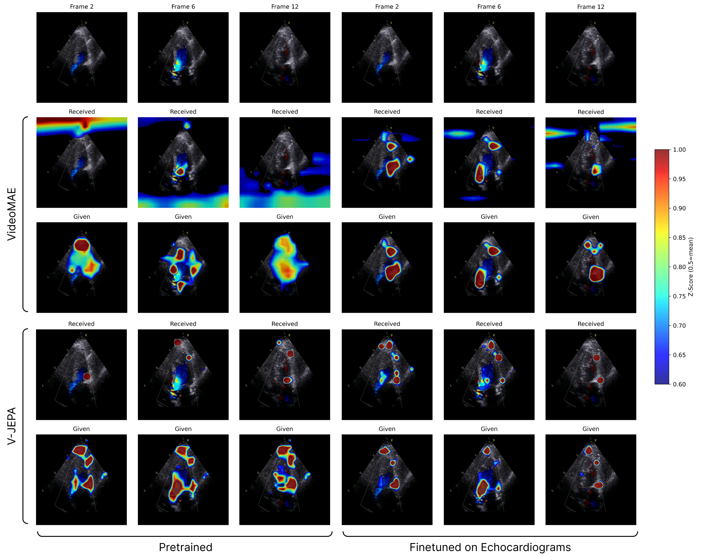

<h1 align="center"><b>EchoJEPA</b></h1>
<h3 align="center">A Latent Predictive Foundation Model for Echocardiography</h3>

<p align="center">
    <a href="https://arxiv.org/abs/2602.02603" target="_blank"></a>
    <a href="https://github.com/bowang-lab/EchoJEPA"></a>
    <a href="https://echojepa.com/"></a>
</p>


## Abstract

Foundation models for echocardiography often struggle to disentangle anatomical signal from the stochastic speckle and acquisition artifacts inherent to ultrasound. We present EchoJEPA, a foundation model trained on 18 million echocardiograms across 300K patients, representing the largest pretraining corpus for this modality to date. By leveraging a latent predictive objective, EchoJEPA learns robust anatomical representations that ignore speckle noise. We validate this using a novel multi-view probing framework with frozen backbones, where EchoJEPA outperforms state-of-the-art baselines by approximately 20% in left ventricular ejection fraction (LVEF) estimation and 17% in right ventricular systolic pressure (RVSP) estimation. The model also exhibits remarkable sample efficiency, reaching 79% view classification accuracy with only 1% of labeled data versus 42% for the best baseline trained on 100%. Crucially, EchoJEPA demonstrates superior generalization, degrading by only 2% under physics-informed acoustic perturbations compared to 17% for competitors. Most remarkably, its zero-shot performance on pediatric patients surpasses fully fine-tuned baselines, establishing latent prediction as a superior paradigm for robust, generalizable medical AI.

<p align="center">
	
</p>

EchoJEPA models trained on just 1% of labeled data outperform baselines trained on 100%. This efficiency implies that latent prediction yields dense representations capable of defining the view manifold with minimal supervision, as evidenced by the distinct anatomical clustering in the figure below.

<p align="center">
	
</p>

EchoJEPA demonstrates anatomical localization, focusing on the mitral valve leaflets, ventricular walls, and annulus while ignoring sector background. Received attention clusters at Doppler jet edges while given attention localizes on valve structures generating flow. Across the cardiac cycle, focus shifts from valve tips during opening to chamber walls during relaxation, indicating it interprets the echocardiogram as a functional biological system.

<p align="center">
	
</p>

---


## Nature Medicine Paper

This repository supports two companion papers. The **ICML preprint** establishes the method (JEPA training, multi-view probing, robustness, sample efficiency, pediatric transfer). The **Nature Medicine paper** (active) demonstrates that EchoJEPA's frozen representations encode clinical information far beyond standard echocardiographic measurements — hemodynamic inference from structural views, right ventricular mechanics, trajectory forecasting, rare disease detection, clinical outcome prediction, and fairness analysis.

All downstream tasks use **frozen depth=1 attentive probes** (no fine-tuning) with prediction averaging across clips per study.

| What | Location |
|------|----------|
| Manuscript (LaTeX) | `uhn_echo/nature_medicine/sn-article.tex` |
| Task overview | `uhn_echo/nature_medicine/context_files/nature_medicine_task_overview.md` |
| UHN task CSVs | `experiments/nature_medicine/uhn/probe_csvs/` |
| MIMIC task CSVs | `experiments/nature_medicine/mimic/probe_csvs/` |
| Precomputed embeddings | `experiments/` ([docs](experiments/README.md)) |
| Probe configs | `configs/eval/vitg-384/nature_medicine/` |

### Quickstart: MIMIC Probe Training

Train a frozen attentive probe on any MIMIC structured measurement task in one command. The open-source model is **EchoJEPA-L-K** (ViT-Large, 304M params, Kinetics-initialized, pretrained + annealed on MIMIC-IV-Echo).

```bash
# Install
pip install -e .

# Train (uses 20 HP combos in parallel, selects best by val metric)
python -m evals.main \
    --fname configs/eval/vitl/nature_medicine/echojepa_l_k_mitral_regurg.yaml \
    --devices cuda:0 cuda:1 cuda:2 cuda:3

# Available tasks (swap the config filename):
#   echojepa_l_k_mitral_regurg.yaml       4-class MR severity (4,713 studies)
#   echojepa_l_k_tricuspid_regurg.yaml    4-class TR severity (4,666 studies)
#   echojepa_l_k_lv_wall_thickness.yaml   4-class LVH grading (4,676 studies)
#   echojepa_l_k_lvef_structured.yaml     LVEF regression (3,159 studies)
#   echojepa_l_k_septal_thickness.yaml    Septal thickness regression (4,718 studies)
#   echojepa_l_k_wm_inf_base.yaml        4-class wall motion (474 studies)
#   echojepa_l_k_wm_inf_mid.yaml         4-class wall motion (410 studies)
#   echojepa_l_k_wm_apical_cap.yaml      4-class wall motion (330 studies)
#   echojepa_l_k_wm_ant_sept_mid.yaml    4-class wall motion (282 studies)
#   echojepa_l_k_mortality_1yr.yaml       Binary 1-year mortality (7,243 studies)
```

Requires the EchoJEPA-L-K checkpoint at `checkpoints/anneal/keep/vitl-kinetics-pt220-an55.pt` and S3 access to `s3://echodata25/mimic-echo-224px/`. Results are written to `evals/vitl/nature_medicine/video_classification_frozen/<tag>/` with per-epoch metrics in `log_r0.csv` and probe weights in `best.pt`.

See [`experiments/nature_medicine/mimic/probe_csvs/README.md`](experiments/nature_medicine/mimic/probe_csvs/README.md) for the full reference: CSV format, task inventory, output structure, config fields, and how to add new tasks.

---


## Quickstart: LVEF Inference on MIMIC-IV-Echo

Predict left ventricular ejection fraction (LVEF) from echocardiogram videos using a pretrained EchoJEPA-L-K encoder + frozen attentive probe. This walkthrough uses the `lvef_structured` dataset from MIMIC-IV-Echo (3,159 studies, 39K clips across A4C and A2C views).

### 1. Install

```bash
conda create -n vjepa2 python=3.12
conda activate vjepa2
pip install -e .
```

### 2. Download checkpoints and data

Download the following from the [shared Google Drive](https://drive.google.com/drive/u/0/folders/17ouOsb_lSf7sfhuM0vOZu2s6xMMtAo_A) and place them in your repo root:

| File | Drive Location | Local Path | Description |
|------|---------------|------------|-------------|
| `vitl-kinetics-pt220-an55.pt` | `checkpoints/` | `checkpoints/vitl-kinetics-pt220-an55.pt` | Frozen ViT-L encoder (304M params). Kinetics-initialized, pretrained + annealed on MIMIC-IV-Echo. |
| `echojepa-l-k-lvef.pt` | `probes/lvef/` | `probes/echojepa-l-k-lvef.pt` | Trained LVEF probe head (d=1 attentive, 12 HP heads). |
| `lvef_structured.tar.gz` | `datasets/` | — | Task CSVs + Z-score normalization params. |

```bash
# Unpack the dataset CSVs
mkdir -p datasets
tar -xzf lvef_structured.tar.gz -C datasets/
```

This produces:
```
datasets/lvef_structured/
  train.csv          # 28,514 clips (3,159 studies)
  val.csv            #  5,463 clips (626 studies)
  test.csv           #  5,847 clips (646 studies)
  zscore_params.json # {"target_mean": 54.71, "target_std": 13.13}
```

### 3. Prepare videos

The CSVs reference preprocessed MP4 files from MIMIC-IV-Echo. You need to convert the original DICOMs:

```bash
# Download MIMIC-IV-Echo (requires PhysioNet credentials + signed DUA)
wget -r -N -c -np https://physionet.org/files/mimic-iv-echo/0.1/

# Convert DICOMs to MP4 and apply sector mask
python preprocessing/convert_dicom.py \
    --input_dir /path/to/mimic-iv-echo/files \
    --output_dir /path/to/mimic-mp4s \
    --resolution 224 --workers 8

python preprocessing/apply_mask.py \
    --input_dir /path/to/mimic-mp4s \
    --output_dir /path/to/mimic-mp4s-masked
```

Then update the video paths in the CSVs to match your local directory. The CSVs are space-delimited (`<video_path> <lvef_value>`, no header):

```bash
# Replace the S3 prefix with your local video path
sed -i 's|s3://echodata25/mimic-echo-224px/|/path/to/mimic-mp4s-masked/|g' datasets/lvef_structured/*.csv
```

### 4. Run inference

```bash
python -m evals.main \
    --fname configs/inference/vitl/mimic_lvef_structured.yaml \
    --devices cuda:0
```

Use more GPUs for faster inference (e.g., `--devices cuda:0 cuda:1 cuda:2 cuda:3`). On 4 A100s, ViT-L inference on ~6K test clips takes about 10 minutes.

### 5. Results

Output is written to `output/inference/video_classification_frozen/lvef-mimic-echojepa-l-k/`:

| File | Contents |
|------|----------|
| `log_r0.csv` | Per-head metrics: train MAE, val MAE, R², Pearson r |
| `study_predictions.csv` | Per-study predictions: study_id, label (real LVEF %), prediction, n_clips |

The probe was trained with 12 hyperparameter combinations (4 LR x 3 weight decay). The best head is selected automatically by validation R². Predictions in `study_predictions.csv` are de-normalized back to real LVEF units (%).

**How it works:** Each video clip is decoded (16 frames, stride 2, 224px) and passed through the frozen ViT-L encoder, producing 1,568 spatiotemporal tokens. The d=1 attentive probe (a single cross-attention layer with a learned query) pools these tokens into a scalar LVEF prediction. For study-level evaluation, all clips in a study are scored independently and predictions are averaged.

---


## Setup

```bash
conda create -n vjepa2 python=3.12
conda activate vjepa2
pip install .  # or `pip install -e .` for development mode
```

---

## Checkpoints

The EchoJEPA-L-K checkpoint (`vitl-kinetics-pt220-an55.pt`) is available on the Google Drive. It is a ViT-Large (304M params) initialized from Kinetics V-JEPA 2, then pretrained (220 epochs) + annealed (55 epochs) on the MIMIC-IV-Echo dataset.


## Datasets

### UHN Echocardiography Database (pretraining + UHN evaluation)

- 18M echocardiograms across ~300K patients (2002-2019)
- Two reporting systems: Syngo (390K studies, 2005-2019) and HeartLab (432K studies, 2002-2014)
- 26M structured measurements, 6.6M clinical observations
- Stored as MP4 on S3: `s3://echodata25/echo-study/`, `echo-study-1/`, `echo-study-2/`
- Master index: `indices/master_index_18M_cleaned.csv` (18M clips)

### MIMIC-IV-Echo (external evaluation)

- 7,243 echo studies from 4,579 patients, ~525K DICOM files
- Publicly available from [PhysioNet](https://physionet.org/content/mimic-iv-echo/1.0/) (requires credentialed access)
- Linked to [MIMIC-IV](https://physionet.org/content/mimiciv/) clinical data: labs, vitals, medications, diagnoses, discharge notes, mortality. And unstructured free-text notes in [MIMIC-IV-Note](https://www.physionet.org/content/mimic-iv-note/).

**Downloading MIMIC-IV-Echo:**

```bash
# Requires PhysioNet credentials and signed DUA
# Option 1: wget (from PhysioNet)
wget -r -N -c -np https://physionet.org/files/mimic-iv-echo/0.1/

# Option 2: AWS S3 (faster, requires PhysioNet-linked AWS credentials)
aws s3 sync s3://physionet-open/mimic-iv-echo/0.1/ /path/to/mimic-echo/
```

This downloads ~525K DICOM files organized as `files/p{group}/p{patient_id}/s{study_id}/`.

---


## Preprocessing

The `preprocessing/` directory contains the full pipeline for preparing raw DICOM echocardiograms into model-ready MP4 files. See [`preprocessing/README.md`](preprocessing/README.md) for detailed documentation.

```
DICOM files → convert_dicom.py → apply_mask.py → upload_s3.py → classify_views.py → check_videos.py
```

**Quick example (MIMIC):**

```bash
# 1. Convert DICOMs to MP4 (native resolution, 30 fps)
python preprocessing/convert_dicom.py \
    --input_dir /path/to/mimic-echo/files \
    --output_dir /path/to/mimic-mp4s \
    --workers 8

# 2. Apply sector mask (blacks out ECG trace, patient info, overlays)
python preprocessing/apply_mask.py \
    --input_dir /path/to/mimic-mp4s \
    --output_dir /path/to/mimic-mp4s-masked

# 3. Upload to S3 (optional)
python preprocessing/upload_s3.py \
    --input_dir /path/to/mimic-mp4s-masked \
    --s3_prefix s3://your-bucket/mimic-echo/ \
    --workers 16

# 4. Run view + color classification (optional, for view-filtered tasks)
python preprocessing/classify_views.py \
    --input_dir /path/to/mimic-mp4s-masked \
    --output_csv /path/to/mimic_classifications.csv \
    --view_checkpoint classifier/checkpoints/view_convnext_small_336px.pt \
    --color_checkpoint classifier/checkpoints/color_convnext_small_336px.pt

# 5. QC check
python preprocessing/check_videos.py --input_dir /path/to/mimic-mp4s-masked
```

**Resolution strategy:** Store at native resolution, resize at runtime. All probe models (EchoJEPA-L-K, EchoPrime, PanEcho, EchoFM, EchoMAE) use **224x224** input resolution. View/color classifiers resize to 336px. For pretraining with repeated reads, pre-resizing to 224px saves I/O: use `--resolution 224` in `convert_dicom.py`.

### Building task CSVs

After preprocessing, task-specific label CSVs are built by scripts that join clip paths with clinical labels. These live in `experiments/`:

```bash
# UHN: 47 regression/classification tasks
python experiments/nature_medicine/uhn/build_probe_csvs.py

# UHN: view-filtered variants (41 tasks)
python experiments/nature_medicine/uhn/build_viewfiltered_csvs.py

# UHN: trajectory forecasting tasks (5 tasks)
python experiments/nature_medicine/uhn/build_trajectory_csvs.py

# MIMIC: outcomes, biomarkers, disease detection (23 tasks)
python experiments/nature_medicine/mimic/build_probe_csvs.py
```

Output CSVs go to `experiments/nature_medicine/{uhn,mimic}/probe_csvs/<task>/` with `train.csv`, `val.csv`, `test.csv` per task. Format is space-delimited: `<video_path> <label>`.

### Video requirements

| Property | Requirement |
|----------|-------------|
| Format | `.mp4` (H.264 codec recommended) |
| Resolution | Any — the pipeline resizes to `crop_size` (typically 224px or 336px) |
| Frame rate | Any — the pipeline samples at the configured `fps` (typically 8 fps) |
| Duration | At least `frames_per_clip / fps` seconds (e.g. 16 frames / 8 fps = 2s minimum) |
| Color | Grayscale or RGB (both work; grayscale is converted to 3-channel internally) |

Videos are decoded on-the-fly using [decord](https://github.com/dmlc/decord). Verify with:

```python
import decord
decord.bridge.set_bridge("torch")
vr = decord.VideoReader("path/to/video.mp4", num_threads=1)
print(f"Frames: {len(vr)}, Resolution: {vr[0].shape}")
```

### Dataset CSV formats

All dataset CSVs are **space-delimited text files** with no header:

```
# Classification (integer labels, 0-indexed)
data/echo_views_22k/19068955.mp4 5
data/echo_views_22k/19076133.mp4 7

# Regression (raw float values — Z-scored at runtime)
s3://echodata25/echo-study/123/456.mp4 62.5
s3://echodata25/echo-study/789/012.mp4 45.2

# Pretraining (dummy label)
mimic-echo-224px/files/p10/p10002221/s94106955/94106955_0001.mp4 0
```

---


## Probe Evaluation

Probe evaluation trains a lightweight head on frozen EchoJEPA features. The **primary evaluation** for Nature Medicine uses depth=1 attentive probes (single cross-attention layer, V-JEPA 1 protocol) with prediction averaging across all clips per study.

| Probe Type | Architecture | Pooling | Use Case |
|-----------|-------------|---------|----------|
| `attentive` (default) | Cross-attention with learnable query | Learned | Primary evaluation (depth=1 for cross-model comparison) |
| `linear` | Single linear layer | Mean pooling | Sensitivity analysis |
| `mlp` | Two-layer MLP with GELU | Mean pooling | Middle ground |

**Why depth=1?** At depth=1 (cross-attention only, no self-attention blocks), the probe architecture is identical regardless of input token count. Models with 1568 tokens (EchoJEPA) benefit from learned aggregation, while models with 1 token (EchoPrime, PanEcho) get a lightweight nonlinear readout.

<p align="center">
	
</p>

### Running probe training

```bash
# Local (single task, single model)
python -m evals.main --fname configs/eval/vitg-384/lvef/echojepa_lvef.yaml \
  --devices cuda:0 cuda:1

# Distributed (SLURM)
python -m evals.main_distributed \
  --fname configs/eval/vitg-384/lvef/echojepa_lvef.yaml \
  --time 8600 --account my_account --qos=my_qos

# Nature Medicine batch runner (all 5 models for a given task)
scripts/run_uhn_probe.sh <task_name>
```

Configs support training multiple probes in parallel with different hyperparameters via `multihead_kwargs` (e.g., 4 LR x 3 WD = 12-head grid). See `configs/eval/` for ready-made configs organized by model and task.

### Training config example

```yaml
eval_name: video_classification_frozen
tag: lvef-echojepa-g
folder: /path/to/output

experiment:
  classifier:
    task_type: regression         # or "classification"
    num_targets: 1                # for classification, use num_classes: N
    probe_type: attentive         # "attentive", "linear", or "mlp"
    num_heads: 16
    num_probe_blocks: 1           # depth=1 (default for Nature Medicine)

  data:
    dataset_type: VideoDataset
    dataset_train: experiments/nature_medicine/uhn/probe_csvs/lvef/train_vf.csv
    dataset_val:   experiments/nature_medicine/uhn/probe_csvs/lvef/val.csv
    resolution: 224
    frames_per_clip: 16
    frame_step: 2
    num_segments: 2
    num_views_per_segment: 1

  optimization:
    batch_size: 2
    num_epochs: 15
    use_bfloat16: true
    multihead_kwargs:
    - lr: 0.0003
      weight_decay: 0.01
    - lr: 0.0001
      weight_decay: 0.01
    - lr: 0.00003
      weight_decay: 0.01
```

### Study-level evaluation

For tasks where each study has multiple clips (MIMIC outcomes, UHN trajectory), enable study-level sampling:

```yaml
experiment:
  data:
    study_sampling: true          # 1 random clip per study per epoch (train + val)
```

At validation time with `val_only: true`, prediction averaging is automatically enabled — all clips are scored and predictions are averaged per study.

---


## Probe Inference

Run inference with a trained probe checkpoint:

```bash
python -m evals.main --fname configs/inference/vitl/lvef.yaml --devices cuda:0 cuda:1
```

Key settings:

```yaml
val_only: true
probe_checkpoint: /path/to/best.pt
predictions_save_path: /path/to/predictions.csv

experiment:
  classifier:                      # must match trained probe config
    task_type: regression
    num_targets: 1
    probe_type: attentive
    num_heads: 16
    num_probe_blocks: 1

  data:
    dataset_val: /path/to/test.csv
    dataset_train: /path/to/test.csv    # can be same as val for inference
    resolution: 224
    frames_per_clip: 16
    frame_step: 2

  optimization:
    batch_size: 4
    num_epochs: 1
    use_bfloat16: true
    multihead_kwargs:
    - lr: 0.0
      weight_decay: 0.0
```

See `configs/inference/` for complete examples.

---


## Pretraining

Pretraining uses a latent predictive objective: the encoder processes visible (context) tokens, the predictor takes encoder output + mask positions to predict the target encoder's representations of masked regions, and the target encoder is updated via EMA.

### Local

```bash
python -m app.main --fname configs/train/vitl16/pretrain-mimic-224px-16f.yaml \
  --devices cuda:0
```

### Distributed (SLURM)

```bash
python -m app.main_distributed \
  --fname configs/train/vitl16/pretrain-mimic-224px-16f.yaml
  --time 6000
  --account my_account --qos=my_qos
```

### Pretrained checkpoints

Since pretraining is self-supervised, all video labels are set to zero. You can begin pretraining from any of the V-JEPA 2 checkpoints:

<table>
  <tr>
    <th>Model</th><th>#Parameters</th><th>Resolution</th><th>Download</th><th>Config</th>
  </tr>
  <tr>
    <td>ViT-L/16</td><td>300M</td><td>256</td>
    <td><a href="https://dl.fbaipublicfiles.com/vjepa2/vitl.pt">checkpoint</a></td>
    <td><a href="configs/train/vitl16">configs</a></td>
  </tr>
  <tr>
    <td>ViT-H/16</td><td>600M</td><td>256</td>
    <td><a href="https://dl.fbaipublicfiles.com/vjepa2/vith.pt">checkpoint</a></td>
    <td><a href="configs/train/vith16/">configs</a></td>
  </tr>
  <tr>
    <td>ViT-g/16</td><td>1B</td><td>256</td>
    <td><a href="https://dl.fbaipublicfiles.com/vjepa2/vitg.pt">checkpoint</a></td>
    <td><a href="configs/train/vitg16">configs</a></td>
  </tr>
  <tr>
    <td>ViT-g/16<sub>384</sub></td><td>1B</td><td>384</td>
    <td><a href="https://dl.fbaipublicfiles.com/vjepa2/vitg-384.pt">checkpoint</a></td>
    <td><a href="configs/train/vitg16">configs</a></td>
  </tr>
</table>

### Pretraining configuration

We keep the configuration mostly the same as V-JEPA 2, but adjust sampling and augmentation for echocardiography:

```yaml
app: vjepa
data:
  dataset_type: VideoDataset
  datasets:
  - /path/to/pretrain_videos.csv       # space-delimited: <video_path> 0
  batch_size: 128
  crop_size: 224
  patch_size: 16
  dataset_fpcs:
  - 16                                 # frames per clip
  fps: 8                               # lower = greater temporal coverage
  tubelet_size: 2
  num_workers: 8
data_aug:
  auto_augment: false
  motion_shift: false
  random_resize_aspect_ratio: [0.9, 1.1]   # narrowed from [0.75, 1.35] for echo
  random_resize_scale: [0.5, 1.0]           # narrowed from [0.3, 1.0] for echo
```

---


## Precomputed Embeddings

For quick prototyping without GPU video decoding, precomputed frozen embeddings are available for ICML benchmarks and MIMIC-IV-Echo (7 models, 23 tasks). See [`experiments/README.md`](experiments/README.md) for full documentation: NPZ formats, sklearn probe training, model comparison, and download instructions.

---


## Code Structure

```
.
├── app/                                   # training loops
│   ├── vjepa/                             #   video JEPA pre-training
│   ├── main.py                            #   local entrypoint
│   └── main_distributed.py                #   SLURM entrypoint
├── configs/                               # YAML experiment configs
│   ├── train/                             #   pretraining and cooldown
│   ├── eval/                              #   frozen probe training
│   └── inference/                         #   inference-only (val_only: true)
├── evals/                                 # evaluation loops
│   ├── video_classification_frozen/       #   single-view probe
│   ├── video_classification_frozen_multi/ #   multi-view probe
│   ├── extract_embeddings.py              #   embedding extraction (legacy)
│   ├── pool_embeddings.py                 #   clip → study-level pooling (legacy)
│   ├── train_probe.py                     #   sklearn probes on NPZ (legacy)
│   ├── main.py                            #   local entrypoint
│   └── main_distributed.py                #   SLURM entrypoint
├── src/                                   # core library (installs as vjepa2)
│   ├── datasets/                          #   VideoDataset, study sampler, data loaders
│   ├── models/                            #   ViT encoder, attentive/linear/MLP probes
│   ├── masks/                             #   mask collators for JEPA masking
│   └── utils/                             #   distributed init, LR schedulers, checkpointing
├── preprocessing/                         # DICOM → MP4 pipeline
│   ├── convert_dicom.py                   #   DICOM → MP4 conversion
│   ├── apply_mask.py                      #   sector masking
│   ├── classify_views.py                  #   view + color classification
│   ├── upload_s3.py                       #   parallel S3 upload
│   └── check_videos.py                    #   video QC stats
├── classifier/                            # ConvNeXt echo view/color classifiers
├── data/                                  # data assets (splits, labels, scalers)
│   ├── csv/                               #   JEPA-format splits (referenced by configs)
│   ├── labels/                            #   raw label CSVs
│   └── scripts/                           #   legacy processing scripts
├── experiments/                           # embeddings and experiment data (by paper)
│   ├── icml/                              #   ICML benchmark embeddings
│   └── nature_medicine/                   #   Nature Medicine UHN + MIMIC pipeline
├── checkpoints/                           # model weights
├── indices/                               # S3 URI manifests for 18M dataset
├── scripts/                               # run scripts, utilities, demos
├── tests/                                 # unit tests
├── uhn_echo/                              # UHN research data, Nature Medicine analysis
└── claude/                                # architecture docs and project references
```

---


## License

The majority of V-JEPA 2 is licensed under MIT, however portions of the project are available under separate license terms:

[src/datasets/utils/video/randaugment.py](src/datasets/utils/video/randaugment.py)<br>
[src/datasets/utils/video/randerase.py](src/datasets/utils/video/randerase.py)<br>
[src/datasets/utils/worker_init_fn.py](src/datasets/utils/worker_init_fn.py)<br>

are licensed under the Apache 2.0 license.

---


## Citation

**Alif Munim, Adibvafa Fallahpour, Teodora Szasz, Ahmadreza Attarpour**, River Jiang, Brana Sooriyakanthan, Maala Sooriyakanthan, Heather Whitney, Jeremy Slivnick, Barry Rubin, Wendy Tsang, Bo Wang

If you find this repository useful in your research, please consider giving a star :star: and a citation
```bibtex
@misc{munim2026echojepalatentpredictivefoundation,
      title={EchoJEPA: A Latent Predictive Foundation Model for Echocardiography},
      author={Alif Munim and Adibvafa Fallahpour and Teodora Szasz and Ahmadreza Attarpour and River Jiang and Brana Sooriyakanthan and Maala Sooriyakanthan and Heather Whitney and Jeremy Slivnick and Barry Rubin and Wendy Tsang and Bo Wang},
      year={2026},
      eprint={2602.02603},
      archivePrefix={arXiv},
      primaryClass={eess.IV},
      url={https://arxiv.org/abs/2602.02603},
}
```
